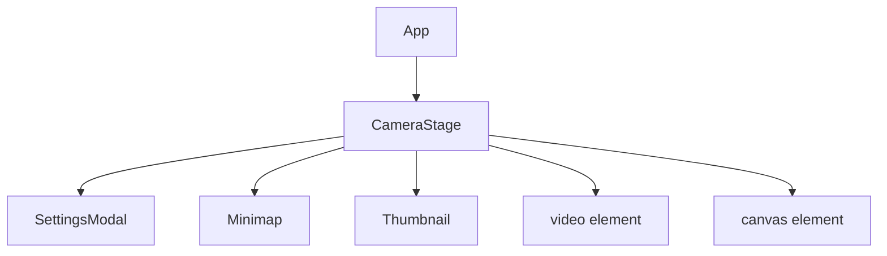
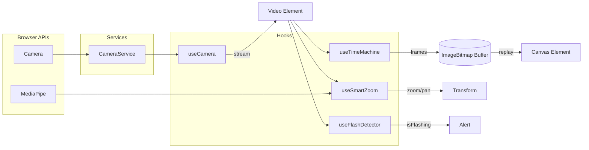
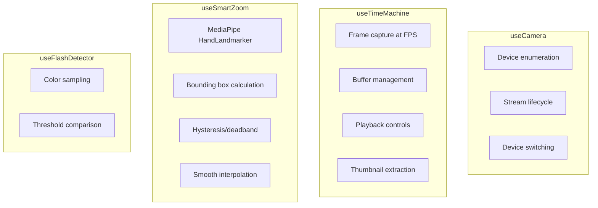

# Magic Monitor 🪄

A smart mirror application designed for real-time feedback, featuring instant replay, AI-powered smart zoom, and flash detection.

## Architecture

### Component Hierarchy



### Data Flow



### Hook Responsibilities



## Features

- **Instant Replay**: Rewind and scrub through the last 60 seconds of video.
- **Smart Zoom**: AI-powered hand tracking automatically zooms and pans to keep you in frame.
- **Minimap**: Always-on context view showing your full field of view when zoomed in.
- **Flash Detection**: Visual alert when the screen flashes (e.g., for testing light sensors).
- **High Quality Mode**: Toggle between performance (LQ) and high-fidelity (HQ) replay buffers.

## Deployment

The application is deployed to Surge.sh.

**Live URL**: [https://magic-monitor.surge.sh](https://magic-monitor.surge.sh)

### How to Deploy

To deploy the latest version:

```bash
just deploy
```

This command builds the project and pushes it to Surge.

## Local Development

1.  Install dependencies:

    ```bash
    npm install
    ```

2.  Start the development server:

    ```bash
    npm run dev
    ```

3.  Open [http://localhost:5173](http://localhost:5173) in your browser.
