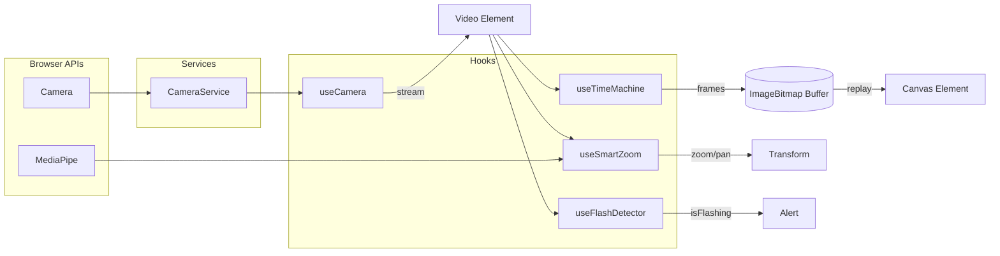

# Magic Monitor

**[Try It Yourself →](https://magic-monitor.surge.sh)**

Turn your webcam into a magic practice mirror. Perfect your sleight of hand with instant replay and AI-powered hand tracking.


## Features

### Instant Replay

Did you just nail that move? Or mess it up? Scrub back through the last 60 seconds to see exactly what happened. No need to set up recording ahead of time—it's always capturing.

### Smart Zoom

AI-powered hand tracking keeps you in frame automatically. Wave your hands and the camera follows. Great for close-up work on hand positions or gestures.

### Minimap

When zoomed in, a small picture-in-picture shows your full view so you never lose context.

### Works Offline

Install it like an app on your phone or desktop—then use it anywhere, even without internet.

**On iPhone/iPad:** Tap the Share button → "Add to Home Screen"

**On Android:** Tap the menu (⋮) → "Install app" or "Add to Home Screen"

**On Desktop (Chrome/Edge):** Click the install icon in the address bar, or Menu → "Install Magic Monitor"

Once installed, it works completely offline. Practice anywhere—no wifi needed.

## Why Magicians Love It

- **Catch your flashes** - Scrub frame-by-frame to spot moments where the secret is exposed
- **Drill without stopping** - Keep practicing while the replay buffer captures everything
- **Hands-free zoom** - Smart Zoom follows your hands automatically so you can focus on the move
- **No setup required** - Just open the page and start practicing. No apps to install, no accounts to create
- **Private by design** - Video stays on your device. Nothing is uploaded anywhere

## Coming Soon

- **Flash Detection** - AI that automatically flags frames where you might be flashing (showing something that should stay hidden)
- **Angle Comparison** - Practice the same move from multiple camera angles

## Getting Started

1. Go to [magic-monitor.surge.sh](https://magic-monitor.surge.sh)
2. Allow camera access when prompted
3. Start practicing!

**Controls:**

- Scroll wheel to zoom in/out
- Click and drag to pan when zoomed
- Use the timeline at the bottom to scrub through replay
- Toggle Smart Zoom with the hand icon

---

## For Developers

<details>
<summary>Architecture & Development</summary>

### Tech Stack

React 19 + TypeScript + Vite + Tailwind CSS

### Local Development

```bash
npm install
npm run dev
# Open http://localhost:5173
```

### Commands

```bash
just dev      # Run development server
just build    # Build for production
just test     # Run unit tests
just e2e      # Run E2E tests (Playwright)
just deploy   # Test, build, and deploy to surge.sh
```

### Architecture



See [CLAUDE.md](CLAUDE.md) for detailed development guidelines.

</details>
