# Smart Zoom Specification

Smart zoom automatically tracks hands in the video feed and adjusts zoom/pan to keep them centered and appropriately sized.

## Constants


## Algorithm Overview

1. Detect hands using MediaPipe HandLandmarker
2. Calculate bounding box of all hand landmarks
3. Compute target zoom and pan from bounding box
4. Apply hysteresis to avoid jitter from small changes
5. Smoothly interpolate (lerp) towards the committed target

## Zoom Calculation

```
targetZoom = 1 / (maxDimension * padding)
```

Where:

- `maxDimension` = max(boundingBoxWidth, boundingBoxHeight) in normalized coords (0-1)
- `padding` = configurable multiplier (default 2.0)

**Clamping**: Zoom is clamped to range [MIN_ZOOM, MAX_ZOOM] = [1, 3]

### Examples

| Box Size | Padding | Raw Target | Clamped |
| -------- | ------- | ---------- | ------- |
| 0.5      | 2.0     | 1.0        | 1.0     |
| 0.25     | 2.0     | 2.0        | 2.0     |
| 0.167    | 2.0     | 3.0        | 3.0     |
| 0.1      | 2.0     | 5.0        | 3.0     |
| 0.05     | 2.0     | 10.0       | 3.0     |

## Pan Calculation

```
panX = (0.5 - centerX) * videoWidth
panY = (0.5 - centerY) * videoHeight
```

Where:

- `centerX`, `centerY` = center of bounding box in normalized coords (0-1)
- `videoWidth`, `videoHeight` = video dimensions in pixels

This shifts the view to center the hands. Positive pan shifts view left/up.

### Examples (1920x1080 video)

| Center X | Center Y | Pan X | Pan Y |
| -------- | -------- | ----- | ----- |
| 0.5      | 0.5      | 0     | 0     |
| 0.8      | 0.5      | -576  | 0     |
| 0.2      | 0.3      | 576   | 216   |

## Viewport Bounds Constraint (No Blank Space)

The video must always completely fill the viewport. When zoomed and panned, no edge of the video may come inside the viewport bounds.

```mermaid
flowchart LR
    subgraph Valid["✅ Valid: Video fills viewport"]
        direction TB
        VP1["Viewport"]
        VID1["Video (zoomed & panned)"]
        VP1 --- VID1
    end

    subgraph Invalid["❌ Invalid: Blank space visible"]
        direction TB
        VP2["Viewport"]
        BLANK["Blank ⬜"]
        VID2["Video (over-panned)"]
        VP2 --- BLANK
        BLANK --- VID2
    end
```



### Pan Clamping Formula

```
maxPanX = videoWidth × (1 - 1/zoom) / 2
maxPanY = videoHeight × (1 - 1/zoom) / 2

clampedPanX = clamp(panX, -maxPanX, +maxPanX)
clampedPanY = clamp(panY, -maxPanY, +maxPanY)
```

**Intuition**: At zoom Z, you see 1/Z of the video. The remaining (1 - 1/Z) is off-screen, split equally on both sides, so max pan = half of that hidden portion.

### Examples (1920×1080 video)

| Zoom | Max Pan X | Max Pan Y | Why                                          |
| ---- | --------- | --------- | -------------------------------------------- |
| 1.0  | 0         | 0         | Video exactly fills viewport, no pan allowed |
| 2.0  | 480       | 270       | See 1/2 of video, can shift by 1/4 of total  |
| 3.0  | 640       | 360       | See 1/3 of video, can shift by 1/3 of total  |

### Debug Indicator (Red Boundary)

When pan is clamped (hit viewport boundary), a red border is drawn on the affected edge(s):

```mermaid
flowchart TB
    subgraph Viewport["Viewport with clamped pan"]
        direction LR
        LEFT["🟥 Left edge<br/>(pan at +maxPanX)"]
        CENTER["Video content"]
        RIGHT["🟥 Right edge<br/>(pan at -maxPanX)"]
        LEFT --- CENTER --- RIGHT
    end

    NOTE["Red border = can't pan further in that direction"]
```



- **Red left edge**: pan clamped at +maxPanX (can't shift view further left)
- **Red right edge**: pan clamped at -maxPanX (can't shift view further right)
- **Red top edge**: pan clamped at +maxPanY (can't shift view further up)
- **Red bottom edge**: pan clamped at -maxPanY (can't shift view further down)

## Hysteresis (Deadband)

To prevent jitter from minor hand movements, new targets are only committed when:

```
zoomDelta > ZOOM_THRESHOLD  OR  panDistance > PAN_THRESHOLD
```

**Thresholds**:

- `ZOOM_THRESHOLD` = 0.1 (10% zoom change)
- `PAN_THRESHOLD` = 50 pixels

If the change is below both thresholds, the committed target remains unchanged and the system continues interpolating toward the previous target.

### Example

1. Initial: Committed target zoom = 2.0
2. New detection: target zoom = 2.05 (delta = 0.05 < 0.1)
3. Result: Committed target stays at 2.0, no change

## Smoothing (Lerp)

Current values interpolate toward committed targets each frame:

```
current = current + (target - current) * smoothFactor
```

**Default smoothFactor**: 0.05 (slower = smoother)

This creates exponential decay toward the target:

- After 1 frame: 5% of the way there
- After 10 frames: ~40% of the way there
- After 50 frames: ~92% of the way there

## No Hands Detected

When no hands are detected, the system smoothly returns to default state:

```
Target: zoom = 1, pan = (0, 0)
Smooth factor: smoothFactor * 0.5 (half speed)
```

The slower return prevents jarring zoom-out when hands briefly leave frame.

## Configuration

| Parameter    | Default | Description                       |
| ------------ | ------- | --------------------------------- |
| padding      | 2.0     | Multiplier for space around hands |
| smoothFactor | 0.05    | Lerp rate (0-1, lower = smoother) |

## External Architecture

How `useSmartZoom` connects to the outside world:


## Internal Processing Flow

What happens each frame inside the detection loop:

```mermaid
flowchart TD
    START([Each Frame]) --> CHECK{Video<br/>playing?}
    CHECK -->|No| WAIT[Wait for next frame]
    CHECK -->|Yes| DETECT["Detect hands<br/>(MediaPipe)"]

    DETECT --> HANDS{Hands<br/>found?}

    HANDS -->|Yes| BBOX["Calculate bounding box<br/>(min/max of all landmarks)"]
    BBOX --> CALC["Calculate targets<br/>zoom = 1/(maxDim × padding)<br/>pan = (0.5 - center) × videoSize"]
    CALC --> CLAMP_ZOOM["Clamp zoom to<br/>[MIN_ZOOM, MAX_ZOOM]"]
    CLAMP_ZOOM --> CLAMP_PAN["Clamp pan to viewport bounds<br/>maxPan = videoSize × (1 - 1/zoom) / 2"]
    CLAMP_PAN --> HYST{"Change exceeds<br/>threshold?<br/>(zoomΔ > ZOOM_THRESHOLD OR<br/>panDist > PAN_THRESHOLD)"}

    HYST -->|Yes| COMMIT["Commit new target"]
    HYST -->|No| KEEP["Keep current target"]

    COMMIT --> LERP["Lerp toward target<br/>current += (target - current) × SMOOTH_FACTOR"]
    KEEP --> LERP

    HANDS -->|No| RESET["Set target to<br/>DEFAULT_ZOOM, DEFAULT_PAN"]
    RESET --> LERP_SLOW["Lerp at half speed<br/>current += (target - current) × SMOOTH_FACTOR_SLOW"]

    LERP --> OUTPUT["Output: zoom, pan,<br/>landmarks, clampedEdges"]
    LERP_SLOW --> OUTPUT
    OUTPUT --> WAIT
    WAIT --> START
```



## State Machine

High-level states:


## Pure Functions for Testing

The following calculations can be extracted as pure functions:

1. `calculateTargetZoom(boundingBox, padding)` → number
2. `calculateTargetPan(boundingBox, videoSize)` → {x, y}
3. `clampPanToViewport(pan, zoom, videoSize)` → {pan: {x, y}, clampedEdges: {left, right, top, bottom}}
4. `shouldCommitTarget(newTarget, committedTarget, thresholds)` → boolean
5. `lerp(current, target, factor)` → number
